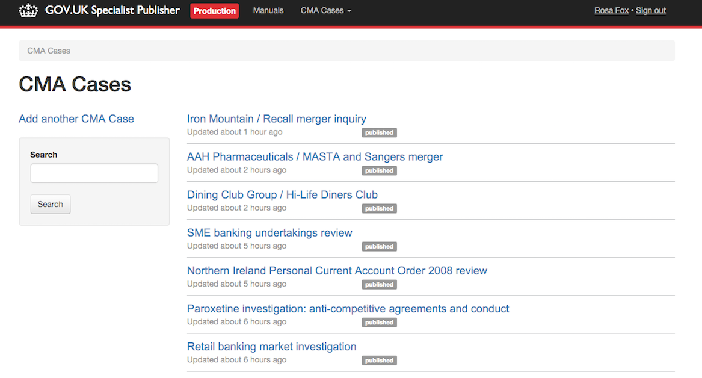

# Specialist Publisher Rebuild

Publishing App for Specialist Documents and Manuals.

## Screenshots


*Specialist Documents - CMA Case Format*


*A Specialist Document on gov.uk*

## Live examples

- [AAIB Reports](https://www.gov.uk/aaib-reports)
- [CMA Cases](https://www.gov.uk/cma-cases)
- [Countryside Stewardship Grants](https://www.gov.uk/countryside-stewardship-grants)
- [DFID Research Outputs](https://www.gov.uk/dfid-research-outputs)
- [Drug Safety Update](https://www.gov.uk/drug-safety-update)
- [ESI Funds](https://www.gov.uk/european-structural-investment-funds)
- [International Development Funds](https://www.gov.uk/international-development-funding)
- [Medical Safety Alerts](https://www.gov.uk/drug-device-alerts)
- [MAIB Reports](https://www.gov.uk/maib-reports)
- [RAIB Reports](https://www.gov.uk/raib-reports)
- [Vehicle Recalls and Faults Alerts](https://www.gov.uk/vehicle-recalls-faults)
- Manuals: There is no public index page for Manuals. They can be found at `gov.uk/guidance/:manual-slug`.

## Nomenclature


- **Format**: Category of a Document. Format names are listed in the `Live Examples` section above and include `MAIB Reports` and `CMA Cases`.
- **Finder**:  Sometimes Formats are referred to as Finders. They are called 'Finders' because each one of them creates a finder on GOV.UK, e.g. https://www.gov.uk/raib-reports. The formats are served by [Finder Frontend](https://github.com/alphagov/finder-frontend).
- **Document**: Specialist Documents are created by Government editors and can be published to gov.uk. Documents differ from each other depending on their format. These differences are largely determined by what is contained in the [schema](https://github.com/alphagov/specialist-publisher-rebuild/blob/add-dfid-review-status/lib/documents/schemas/aaib_reports.json) of a format.
- **Schema**: JSON files defining attributes for each format, including `base_path`, `document_noun` and `document_type`. It also contains the facets and their possible values for each `document_type` which are displayed by `_form.html.erb`.
- **Manual**: Grouped Documents published as a number of sections inside a parent document.

## Technical documentation

Specialist Publisher Rebuild is a Ruby on Rails application used to create and manage documents and manuals. This application does not store documents and manuals in a database of its own. Instead it sends JSON data to the publishing-api where it is persisted in a Postgres datastore. This data is then requested from the publishing-api and displayed to the user.

When a document is published, the relevant document information is sent to Rummager enabling it to be searchable on gov.uk.

Another result of publishing a document is that a call is made to the Email Alert Api which will notify Gov Delivery to send an email to subscribers. These emails are sent when a document is first published and also when an editor makes a major update. This is true for all formats other than Drug Safety Updates which are instead sent via a monthly email newsletter.

Attachments are sent to and then handled by Asset Manager. When an attachment is uploaded, Asset Manager will scan the attachment for viruses and then return a URL from which the attachment can be viewed.

The original [Specialist-Pubisher](https://github.com/alphagov/specialist-publisher) contained Manuals and Finders in the same application. Currently Manuals are still being served by the original Specialist-Publisher. It is likely that as a future part of the rebuild, manuals will be separated out into their own application.

### Live (but flagged as pre-production)
* [UTAAC Decisions](https://www.gov.uk/utaac-decisions)

## Dependencies

- [alphagov/asset-manager](http://github.com/alphagov/asset-manager): provides uploading for static files
- [alphagov/rummager](http://github.com/alphagov/rummager): allows documents to be indexed for searching in both Finders and site search
- [alphagov/publishing-api](http://github.com/alphagov/publishing-api): documents are sent here, persisted and then requested.
- [alphagov/email-alert-api](http://github.com/alphagov/email-alert-api): sends emails to subscribed users when documents are published
- Mongo: mongodb used for storing local users
- [These Gems](https://github.com/alphagov/specialist-publisher-rebuild/blob/master/Gemfile)

### Running the application

```
$ ./startup.sh
```
If you are using the GDS development virtual machine then the application will be available on the host at https://specialist-publisher-rebuild.dev.gov.uk/

### Granting permissions

You may find that you can't see any documents after replicating data. To fix
this, you need to grant user permissions in this application:

```bash
bundle exec rake permissions:grant['Chris Patuzzo'] # Or whichever user you're logged in as.
```

You also need to set the `app_name` for the Dummy API User in Publishing API:

```ruby
User.find_by(email: "dummyapiuser@domain.com").update!(app_name: "specialist-publisher")
```

### Populate development database

If you're starting from a blank database, you can quickly get your local database into working order with:

```
$ bundle exec rake db:seed
```

Currently this:
* creates a default user record with basic permissions that allows you to log in and create a new document


### Running the test suite

```
$ bundle exec rake
```

## Adding a new Specialist Document format

Use [this](https://github.com/alphagov/specialist-publisher-rebuild/commit/19218ed625d4c3539bdaec481b250e726258e3aa) as a template.

## Deployment

Currently, this app is deployed along side with [Specialist-publisher v1](https://github.com/alphagov/specialist-publisher) on a "per-format" basis. As more formats become production ready, we will transition them to use the rebuild app.


The rebuild app can then be accessed in two ways.

1. At the URL `specialist-publisher.*.gov.uk`: you can access the "Frankenstein" app, a combination between SPv1 + SPv2.

2. At `specialist-publisher-rebuild-standalone.integration.publishing.service.gov.uk`: This is an integration-only instance of the app running only specialist-publisher-rebuild code.

When a format is ready to deploy to production, add the endpoint to this [puppet configuration](https://github.com/alphagov/govuk-puppet/blob/master/modules/govuk/manifests/node/s_backend_lb.pp#L48). This will configure Nginx to route requests for those endpoints to be handled by this app.
