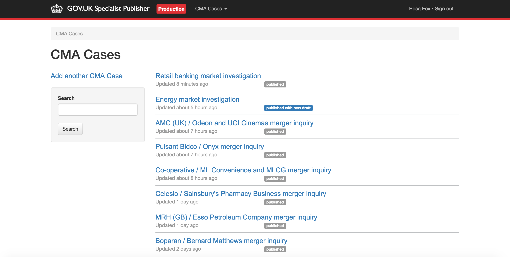
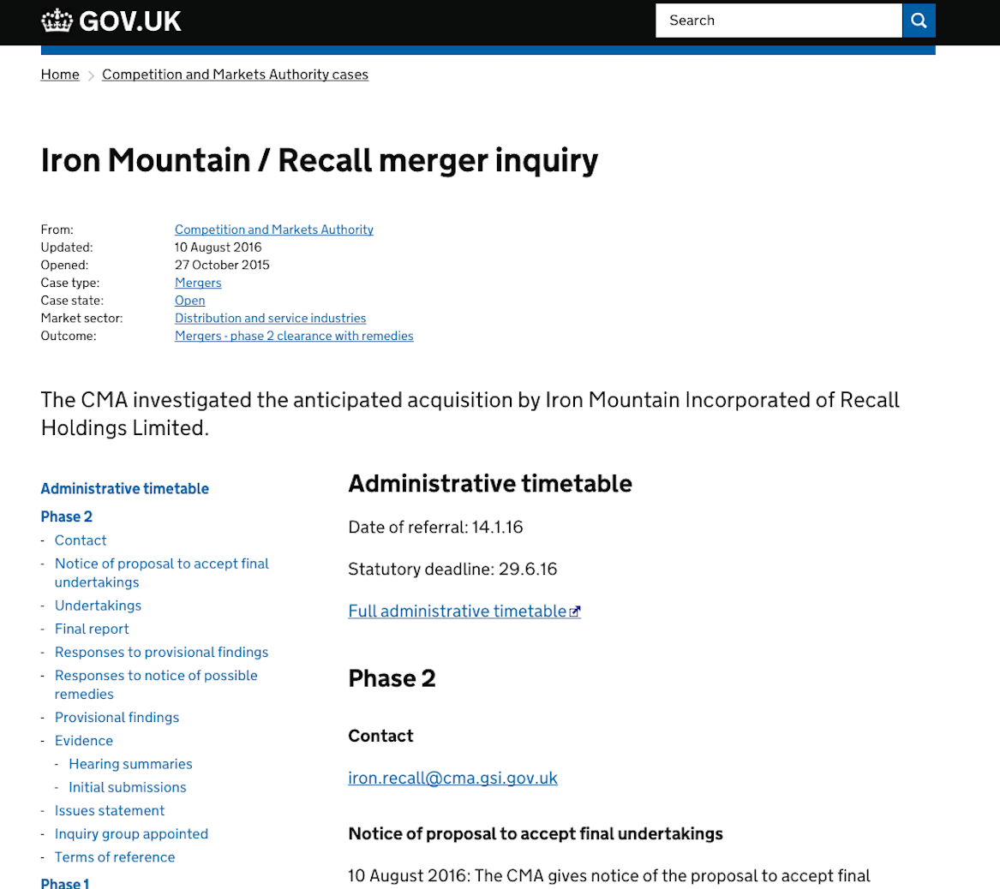

# Specialist Publisher

Publishing App for Specialist Documents.

This application does not store documents in a database of its own. Instead it uses Publishing API to store and retrieve documents. MongoDB is used for storing local user records.

Formats can be [flagged](https://github.com/alphagov/specialist-publisher/blob/f8e93142dfad6f3971a73c923b01f2e7352bdb54/lib/documents/schemas/tax_tribunal_decisions.json#L64) as `pre-production`. `pre-production` documents are only publishable on development and integration.

## Screenshots


*Specialist Documents - CMA Case Format*


*A Specialist Document on gov.uk*

## Live examples

- [AAIB Reports](https://www.gov.uk/aaib-reports)
- [Business Finance Support Schemes](https://www.gov.uk/business-finance-support)
- [CMA Cases](https://www.gov.uk/cma-cases)
- [Countryside Stewardship Grants](https://www.gov.uk/countryside-stewardship-grants)
- [Drug Safety Update](https://www.gov.uk/drug-safety-update)
- [ESI Funds](https://www.gov.uk/european-structural-investment-funds)
- [International Development Funds](https://www.gov.uk/international-development-funding)
- [Medical Safety Alerts](https://www.gov.uk/drug-device-alerts)
- [MAIB Reports](https://www.gov.uk/maib-reports)
- [RAIB Reports](https://www.gov.uk/raib-reports)
- [Research For Development Outputs](https://www.gov.uk/research-for-development-outputs)

## Nomenclature

- **Format**: Category of a Document. Format names are listed in the `Live Examples` section above and include `MAIB Reports` and `CMA Cases`.
- **Finder**:  Sometimes Formats are referred to as Finders. They are called 'Finders' because each one of them creates a finder on GOV.UK, e.g. https://www.gov.uk/raib-reports. The formats are served by [Finder Frontend](https://github.com/alphagov/finder-frontend).
- **Document**: Specialist Documents are created by Government editors and can be published to gov.uk. Documents differ from each other depending on their format. These differences are largely determined by what is contained in the [schema](https://github.com/alphagov/specialist-publisher/blob/6f8eee9ef0bd3a4a72638f5e8301225e692145a3/lib/documents/schemas/aaib_reports.json) of a format.
- **Schema**: JSON files defining attributes for each format, including `base_path`, `document_noun` and `document_type`. It also contains the facets and their possible values for each `document_type` which are displayed by `_form.html.erb`.

## Technical documentation

This is a Ruby on Rails app, and should follow [our Rails app conventions](https://docs.publishing.service.gov.uk/manual/conventions-for-rails-applications.html).

You can use the [GOV.UK Docker environment](https://github.com/alphagov/govuk-docker) to run the application and its tests with all the necessary dependencies. Follow [the usage instructions](https://github.com/alphagov/govuk-docker#usage) to get started.

**Use GOV.UK Docker to run any commands that follow.**

### Granting permissions

You may find that you can't see any documents after replicating data. To fix
this, you need to grant user permissions in this application:

```bash
bundle exec rake permissions:grant['Chris Patuzzo'] # Or whichever user you're logged in as.
```

You also need to set the `app_name` for the Dummy API User in Publishing API:

```ruby
User.find_by(email: "dummyapiuser@domain.com").update!(app_name: "specialist-publisher")
```

### Running the test suite

```
$ bundle exec rake
```

### Further documentation

- [Email alerts](/docs/email-alerts.md)
- [Rake tasks](/docs/tasks.md)
- [Creating a new specialist document type](/docs/creating-a-new-specialist-document-type.md)
- [Historical info about migrating to use the Publishing API](/docs/phase-2-migration/README.md)
