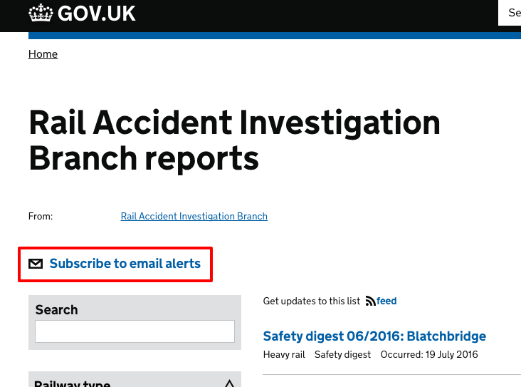
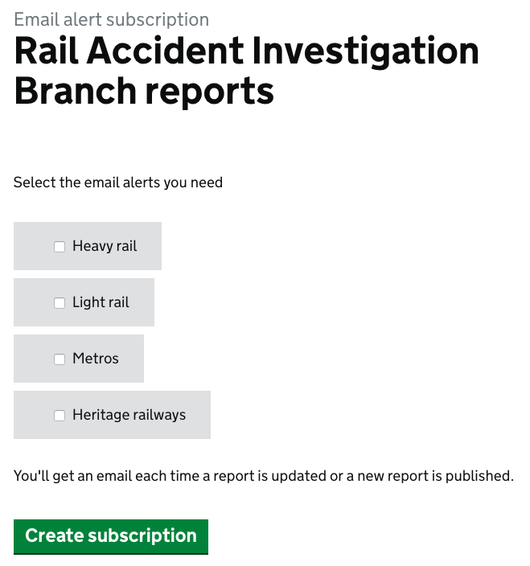
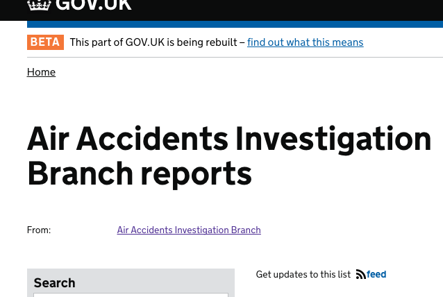

## Email Alerts

When a document is published or has been given a 'major' update, a call is made to the Email Alert Api which will notify Gov Delivery to send an email to subscribers.

This is true for all formats other than Drug Safety Updates which are instead sent via a monthly email newsletter.

For most formats, users can subscribe to email alerts by clicking on a link similar to this:

www.gov.uk/raib-reports

*Email Notification Subscribe Link*

The categories that can be signed up for are specified within the [schema](https://github.com/alphagov/specialist-publisher/blob/main/lib/documents/schemas/raib_reports.json#L20) for the document type.

Not all finders have a 'subscribe' link directly on their index page.

www.gov.uk/aaib-reports

Users can instead subscribe to emails via the [organisation page](https://www.gov.uk/government/email-signup/new?email_signup%5Bfeed%5D=https%3A%2F%2Fwww.gov.uk%2Fgovernment%2Forganisations%2Fair-accidents-investigation-branch.atom).

[Here](https://docs.google.com/spreadsheets/d/1xr6Ivwh0yzKESv-SrGC7i3QKU3IW5_tQsFhe2v9TSbc/edit#gid=0) is a discovery for email alert subscriptions.

When a user signs up to email alerts, they will be added to a subscriber list in Gov Delivery.

When a document is published or has a major update, a notification is sent to Email Alert API. Email Alert API is in sync with Gov Delivery and will notify Gov Delivery to send an email.
