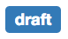
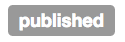
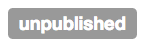
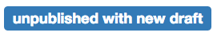

## Composed states

There are a total of five state labels in Specialist Publisher. Here they are:










The last two of these labels are composed of multiple states. When content has
these state labels, it does not affect the
[workflow of content](./workflow-of-content.md). It is purely a presentational
feature.

This information is derived from the `state_history` field returned by the
Publishing API. This is a hash that maps user-facing version to state for the
history of that content item, e.g.

```ruby
{
  1 => "superseded",
  2 => "published",
  3 => "draft",
}
```

All of the information needed to render the state label can be retrieved from
the highest two keys in this hash. Currently, this is handled in the
[StateHelper](https://github.com/alphagov/specialist-publisher-rebuild/blob/main/app/helpers/state_helper.rb).
