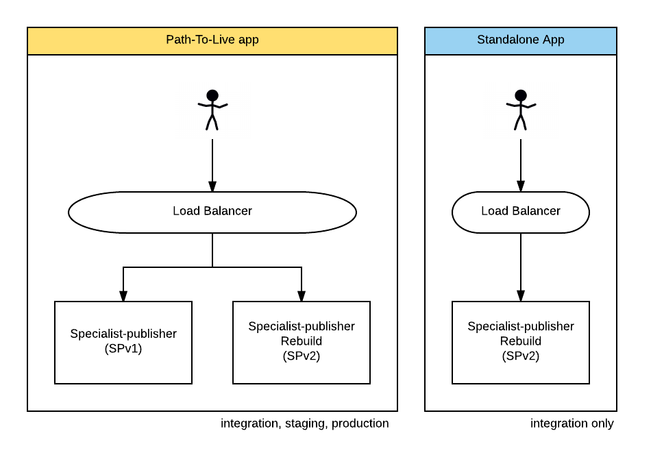

## Roll-out process

Mid-way through the project, we decided that it would be safer to roll out
formats one at a time, rather than as a "big bang" switchover to the rebuild
application. In order to accommodate that, we needed to set up the
infrastructure in a way that would let some of the formats be served from the
old applications, whilst letting some be served from the rebuild.

To achieve this, we deployed the rebuild into staging and production alongside
the existing app. We then configured the loadbalancer, through puppet, to
control which application should serve each request. Initially, all traffic went
to the existing app, apart from `/rebuild-healthcheck` that we used for
monitoring. To roll out a new format, we'd make a puppet change
[here](https://github.com/alphagov/govuk-puppet/blob/7363fdddb1e85aec4b1436c8869af3b3b36055f4/modules/govuk/manifests/node/s_backend_lb.pp#L48) and promote puppet to staging / production.

We also added a "standlone" application that would always run the latest rebuild
code, regardless of which formats had migrated. This was used in integration
(only) for QA before formats went live. This diagram shows this setup:

