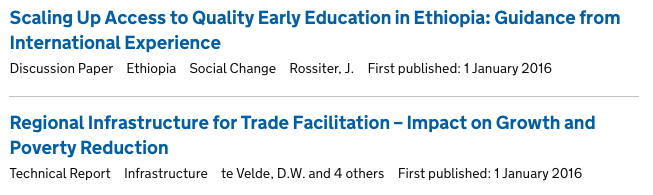
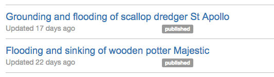
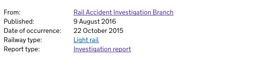

## Timestamps

There are three different timestamps that play different roles:

- first_published_at
- last_edited_at
- public_updated_at

In addition to these, some formats have timestamps that can be set by
writers/editors when content items are created, e.g. 'Date of occurrence'.

## first_published_at

This timestamp is set automatically by the Publishing API the first time a
content item is published. For some of the formats, we present this timestamp
next each document in the finder if it has been specified in the
[schemas](https://github.com/alphagov/specialist-publisher-rebuild/tree/39745ac21b8717130cb3d210469b06cfb2ea72ca/lib/documents/schemas):

Internally, we use this field for checking whether the content is a
'first draft', which determines whether we prompt the user for an update_type or
whether we automatically set it to 'First published.' Research For Development Outputs work
a [bit differently](https://github.com/alphagov/specialist-publisher/blob/5351b28bdf30e2bef28ac2040cc286722c3c1ef5/app/models/research_for_development_output.rb#L27-30)
because that field can be explicitly set by a user.

## last_edited_at

This timestamp is set automatically by the Publishing API on a PUT /v2/content
request with an update_type of 'minor' or 'major'. This field is used to order
content items on the index pages of the publishing app so that writers/editors
see a chronological list of content they have worked on:

Initially, we used the 'updated_at' field for this, but ran into trouble with
republishing, which effected this field.

## public_updated_at

This timestamp is set automatically by the Publishing API on publish if the
update_type is 'major'. This field is presented to users of GOV.UK when viewing
content. This appears in the 'metadata' of content items in the frontend:

In the image above, you can also see a bespoke timestamp that's used by some of
the finders. In this case 'Date of occurence' is a field that can be set by
writers/editors for the RAIB Reports format.
