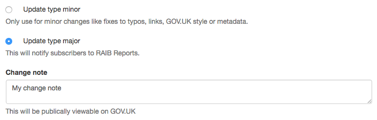

## Update types

An update type is set whenever content is saved within the publishing app. The
update type determines whether an email is sent and 'major' updates have
accompanying change notes that are saved on the document. If the document is a
'first draft', i.e. it has never been published, its update type is set to
'major'. Otherwise, the user can choose what the update type should be:

If the update type is 'major', we send a request to the Email Alert API when the
content is published. The only exception to this is the 'Drug Safety Update'
format which has this [explicitly
disabled](https://github.com/alphagov/specialist-publisher-rebuild/blob/39745ac21b8717130cb3d210469b06cfb2ea72ca/app/models/drug_safety_update.rb#L16-L18). Instead, the MHRA manually send out a monthly digest of
updates through the govdelivery interface.

If the content item is a 'first draft', we also artificially add a
'First published.' change note to the content item. We do this immediately
before the content is published by issuing a separate `PUT /v2/content` request
to the Publishing API. You can see this
[here](https://github.com/alphagov/specialist-publisher-rebuild/blob/39745ac21b8717130cb3d210469b06cfb2ea72ca/app/models/document.rb#L277-L281).

## Temporary update types

We ran into quite a few problems with update types in relation to attachments.
When an attachment is added to a content item, some metadata is saved in its
details hash that contains the name and url of the uploaded attachment. This is
problematic because the update_type set by a user could be overridden by this
update. If an update_type hasn't been chosen yet, adding an attachment shouldn't
pre-select one, either.

We ended up solving this problem by reusing the update_type (and change note)
set by a user when adding attachments to content. If the content is newly
drafted after being published/unpublished, it doesn't have an update_type yet.
In this case, we use an update_type of 'minor', but also set a
'temporary_update_type' field, which is a boolean. The next time that content
item is retrieved, we remove the update_type if temporary_update_type is set.

Arguably this is not a very nice solution, but it does work. From a user's
perspective, the act of adding an attachment does not interfere with the
update_type or change note they have set.
