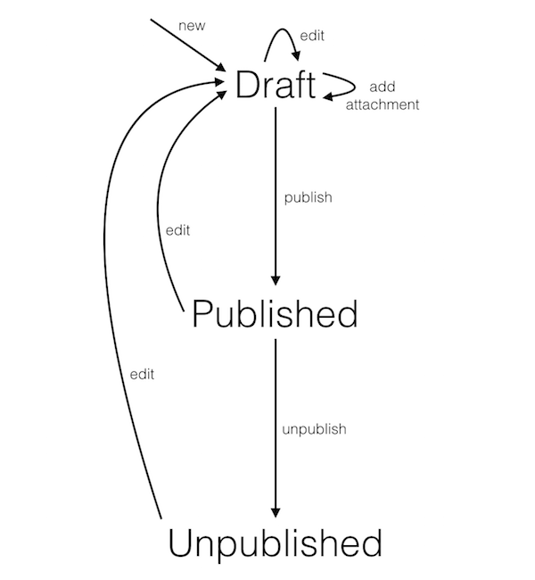

## Workflow of content

The diagram below shows the workflow of content within the Specialist Publisher
app. Each arrow corresponds to an action that transitions content from one state
to another.

## Explanation

Content can either be in a draft, published or unpublished state. Draft content
is accessible via the draft stack (draft-origin) which is used by writers and
editors who would like to preview their content before it goes live. Unpublished
content shows a 410 "This content is no longer here" page on GOV.UK.

Content must be created in a draft state. After that, there are three choices.
The content can either be edited, an attachment could be added or the content
could be published. If an attachment is added, its metadata is added to the
content item in the details hash.

If the content is published, a new draft can be created from it. Alternatively,
it can transition to unpublished. When content is unpublished, a new draft must
be created before it can be published again. Similarly, if the content is
published and there is also a draft, the draft must be published in order to
unpublish the content.

Drafts can also be discarded by the user.

## API requests

This section lists the API requests made at each transition. In total,
Specialist Publisher speaks to four external services.

**new / edit**

- Publishing API: PUT /v2/content
- Publishing API: PATCH /v2/links

**add attachment**

- Publishing API: PUT /v2/content
- Asset Manager: POST /assets

**delete attachment**
- Publishing API: PUT /v2/content
- Asset Manager: DELETE /assets/:id

**publish**

- Publishing API: POST /v2/publish
- Rummager: POST /documents
- Email Alert API: POST /notifications

**unpublish**

- Publishing API: POST /v2/unpublish
- Rummager: DELETE /documents

**discard draft**

- Publishing API: POST /v2/content/:content_id/discard-draft

In addition to these, Specialist Publisher also makes GET requests to the
following endpoints:

- Publishing API: GET /v2/content/:content_id
- Publishing API: GET /v2/content

The first endpoint is used for retrieving a specific content item. The second
is used (with some query parameters) to retrieve an index of content that is
used for the listing pages of the app.

Note: In Specialist Publisher, we send a `PATCH /v2/links` request when a
document is saved. This may not be the right approach for other apps because
changes take effect immediately in both the draft and live content stores.
Instead, it may be better to make this request immediately before publish.
